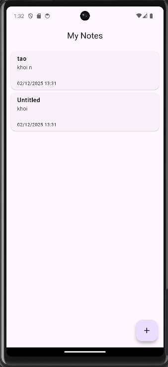
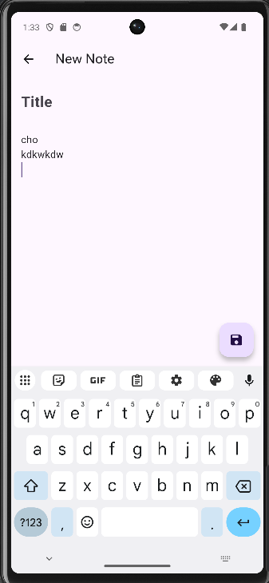
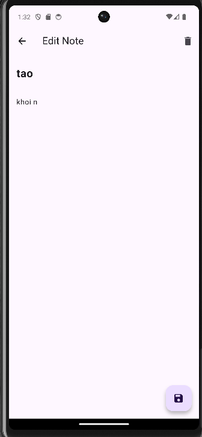
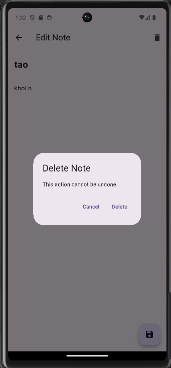

# Flutter Note App  
**Ứng dụng ghi chú sử dụng Flutter – SQLite – Provider**

---

## 📝 Giới thiệu

Flutter Note App là ứng dụng ghi chú đơn giản, nhẹ và nhanh, được xây dựng để thực hành quản lý trạng thái và lưu trữ dữ liệu cục bộ trong Flutter.  
Ứng dụng áp dụng mô hình **Provider + SQLite**, kết hợp **Singleton Database Helper**, và triển khai đầy đủ các chức năng CRUD.

Dự án phù hợp với sinh viên hoặc người mới học Flutter muốn làm quen với database local và state management.

---

## 🚀 Chức năng nổi bật

| Tính năng              | Mô tả |
|------------------------|-------|
| ➕ Thêm ghi chú         | Tạo ghi chú mới gồm tiêu đề và nội dung, tự động thêm thời gian tạo |
| 📋 Danh sách ghi chú   | Hiển thị toàn bộ ghi chú, sắp xếp theo thời gian cập nhật gần nhất |
| ✏️ Chỉnh sửa ghi chú    | Chạm vào ghi chú → chuyển đến editor → lưu thay đổi |
| 🗑 Xóa ghi chú          | Có popup xác nhận để tránh thao tác nhầm |
| 💾 Lưu trữ vĩnh viễn    | Ghi chú được lưu trong SQLite, dữ liệu không bị mất khi thoát app |
| 🔄 Cập nhật UI tự động | Provider đảm bảo giao diện cập nhật realtime khi dữ liệu thay đổi |

---

## 🧩 Công nghệ sử dụng

| Gói               | Vai trò |
|-------------------|---------|
| **sqflite**       | Cơ sở dữ liệu SQLite |
| **provider**       | Quản lý trạng thái ứng dụng |
| **path_provider** | Lấy đường dẫn nơi lưu database |
| **path**          | Hỗ trợ xử lý đường dẫn |
| **intl**          | Format ngày tháng  |
| **cupertino_icons** | Icon hệ thống |

---

## 📁 Cấu trúc thư mục


```
lib/
├── main.dart                     
├── models/
│   └── note.dart                 
├── database/
│   └── db_helper.dart            
├── providers/
│   └── note_provider.dart       
├── screens/
│   ├── home_page.dart            
│   └── note_editor_screen.dart   
└── widgets/
    └── note_card.dart            
```

---

### Hướng dẫn cài đặt & chạy

#### Các bước thực hiện
```bash
# 1. Clone hoặc giải nén source code
Fluter create week5_exercise
# 2. Vào thư mục dự án
cd week5_exercise
# 3. Lấy dependencies
flutter pub get
# 4. Chạy ứng dụng
flutter run
```

---

###  Ảnh chụp màn hình 
| Màn hình chính           | Tạo ghi chú mới             |
|--------------------------|-----------------------------|
|  |  |


| Chỉnh sửa                     | Xác nhận xóa                      |
|-------------------------------|-----------------------------------|
|  |  |
---

### ✅ Mức độ hoàn thành yêu cầu

| Yêu cầu                               | Trạng thái thực hiện |
|---------------------------------------|----------------------|
| SQLite + sqflite                      | ✔ Hoàn thành         |
| Provider quản lý trạng thái           | ✔ Hoàn thành         |
| CRUD đầy đủ                           | ✔ Hoàn thành         |
| Timestamp (createdAt, updatedAt)      | ✔ Hoàn thành         |
| Xác nhận trước khi xóa                | ✔ Hoàn thành         |
| Lưu dữ liệu sau khi thoát ứng dụng    | ✔ Hoàn thành         |
---
